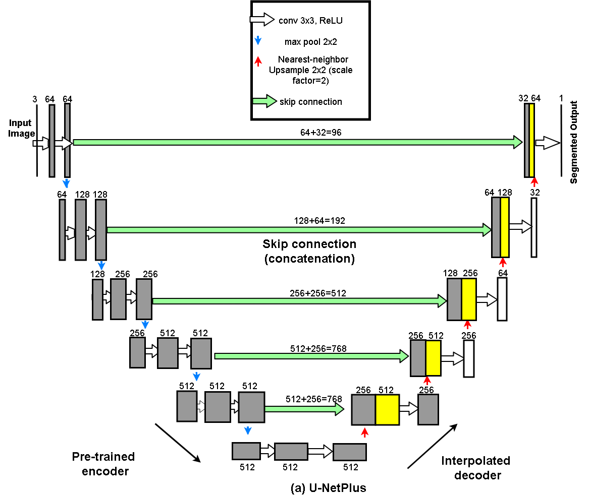
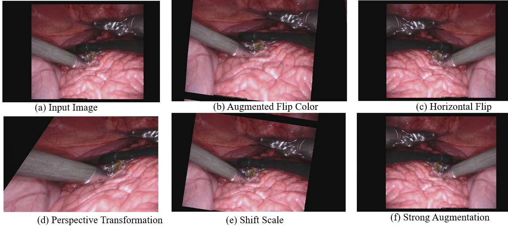
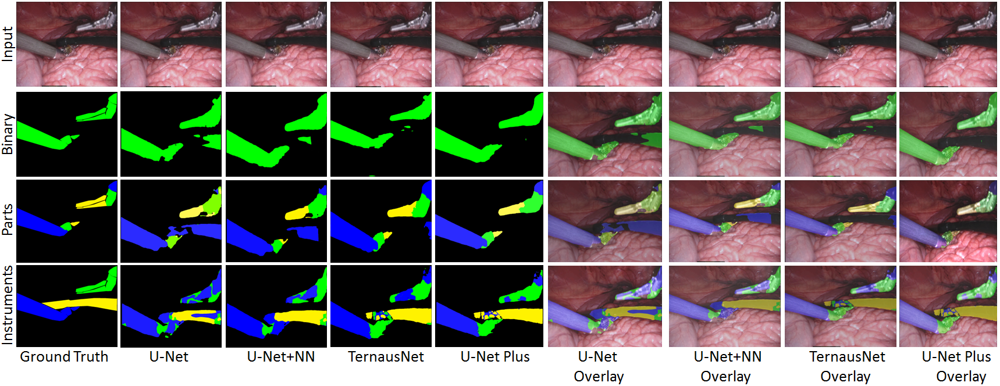
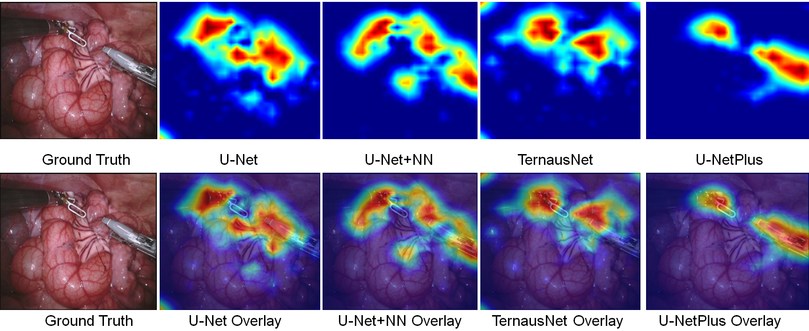

# UNetPlus 
Pytorch implementation of our modified encoder-decoder framework

This repository contains code to train state-of-the-art surgical instruments segmentation networks as described in this paper:
U-NetPlus: A Modified Encoder-Decoder U-Net Architecture for Semantic and Instance Segmentation of Surgical Instrument. This architecture is trained on [MICCAI EndoVIs 2017 sub-challenge.](https://endovissub2017-roboticinstrumentsegmentation.grand-challenge.org)


# Prerequisites
Our code is compatible with python 3.7 or onward.

We depend on some python packages which need to be installed by the user:

* PyTorch
* tqdm
* SimpleITK
* sklearn
* numpy

# Authors 
* S. M. Kamrul Hasan ([sh3190@rit.edu])()
* Cristian A. Linte

# Contents 

* [Data]()
* [Method]()
* [Results]()
* [How to Run]()


**U-NetPlus: A Modified Encoder-Decoder U-Net Architecture for Semantic and Instance Segmentation of Surgical Instruments from Laparoscopic Images** EMBC 2019, Oral \
 {.col-md-12 .text-center style="padding-bottom:20px"}
----------------------------------------------------------------------------------------------------------------------------------------------------------------------

-   [S. M. Kamrul Hasan](http://ai.stanford.edu/~optas/) Rochester
    Institute of Technology
-   [Cristian A. Linte](http://aabdelreheem.me) Rochester Institute of
    Technology

-   [](https://www.ncbi.nlm.nih.gov/pmc/articles/PMC7372295/)

    #### **[ Paper ]**

-   [](#video)

    #### **[ Video ]**

-   [](https://github.com/SMKamrulHasan/UNetPlus)

    #### **[ Code ]**

-   [](#dataset)

    #### **[ Dataset ]**

### **Abstract**

With the advent of robot-assisted surgery, there has been a paradigm
shift in medical technology for minimally invasive surgery. However, it
is very challenging to track the position of the surgical instruments in
a surgical scene, and accurate detection & identification of surgical
tools is paramount. Deep learning-based semantic segmentation in frames
of surgery videos has the potential to facilitate this task. In this
work, we modify the U-Net architecture by introducing a pre-trained
encoder and re-design the decoder part, by replacing the transposed
convolution operation with an upsampling operation based on
nearest-neighbor (NN) interpolation. To further improve performance, we
also employ a very fast and flexible data augmentation technique. We
trained the framework on 8 x 225 frame sequences of robotic surgical
videos available through the MICCAI 2017 EndoVis Challenge dataset and
tested it on 8 x 75 frame and 2 x 300 frame videos. Using our U-NetPlus
architecture, we report a 90.20% DICE for binary segmentation, 76.26%
DICE for instrument part segmentation, and 46.07% for instrument type
(i.e., all instruments) segmentation, outperforming the results of
previous techniques implemented and tested on these data.

### **Video**

--\> --\>

### **Dataset**

For both training and validation, we used the Robotic instruments
dataset from the sub-challenge of MICCAI 2017 Endoscopic Vision
Challenge [22]. The training dataset has 8 × 225 frame sequences with 2
Hz frame rate of high resolution stereo camera images collected from a
da Vinci Xi surgical system during laparoscopic cholecystectomy
procedures. The frames were re-sampled from 30 Hz video to 2 Hz to avoid
any redundancy issues. A stereo camera was used to capture the video
sequences that consists of the left and right eye views with resolution
of 1920 × 1080 in RGB format. In each frame, the articulated parts of
the robotic surgical instrument consisting of a rigid shaft, an
articulated wrist, and claspers, have been manually labeled by expert
clinicians. The test set has 8×75 frame sequences and 2×300 frame
videos. The challenge is to segment 7 classes such as prograsp forceps,
needle driver, vessel sealer, grasping retractor etc. \

### **Method: U-NetPlus**



Modified U-Net with batch-normalized VGG11 as an encoder. Each box
corresponds to a multi-channel featuring a map passing through a series
of transformations. It consists of both an upsampling and a downsampling
path and the height of the box represents the feature map resolution,
while the width represents number of channels. Cyan arrows represent the
max-pooling operation, whereas light-green arrows represent skip
connections that transfer information from the encoder to the decoder.
Red upward arrows represent the decoder which consists of
nearest-neighbor upsampling with a scale factor of 2 followed by 2
convolution layers and a ReLU activation function.

### **Augmentation**



Example images of applying both affine and elastic transformation in
albumentations library for data augmentation.

### **Qualitative Results**



Qualitative comparison of binary segmentation, instrument part and
instrument type segmentation result and their overlay onto the native
endoscopic images of the MICCAI 2017 EndoVis video dataset yielded by
four different frameworks: U-Net, U-Net+NN, TernausNet, and U-NetPlus.

### **Ablation Study**



Attention results: U-NetPlus “looks” at a focused target region, whereas
U-Net, U-Net+NN and TernausNet appear less “focused”, leading to less
accurate segmentation.

### **Citation**

If you find our work useful in your research, please consider citing:

``` {.w3-panel .w3-leftbar .w3-light-grey}
@inproceedings{hasan2019u,
  title={U-NetPlus: A modified encoder-decoder U-Net architecture for semantic and instance segmentation of surgical instruments from laparoscopic images},
  author={Hasan, SM Kamrul and Linte, Cristian A},
  booktitle={2019 41st Annual International Conference of the IEEE Engineering in Medicine and Biology Society (EMBC)},
  pages={7205--7211},
  year={2019},
  organization={IEEE}
}
```

### **U-NetPlus participated post MICCAI EndoVis-2017 Challenge**

Coming soon!

### **Acknowledgements**

Research reported in this publication was supported by the National
Institute of General Medical Sciences of the National Institutes of
Health under Award No. R35GM128877 and by the Office of Advanced Cyber
infrastructure of the National Science Foundation under Award No.
1808530. .


# Note
Contact: S. M. Kamrul Hasan (smkamrulhasan.rit@gmail.com)


